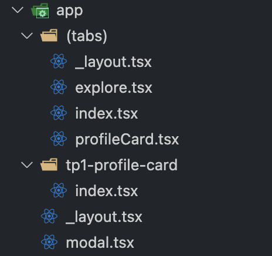
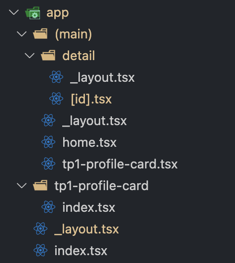

# 📱 RN Advanced Labs

Application **Expo React Native** servant de support pour tous les TP du cours.

## 📑 Sommaire
- [🚀 Prérequis](#-prérequis)
- [▶️ Lancer l’application](#️-lancer-lapplication)
- [📂 Structure attendue](#-structure-attendue)
- [1️⃣ TP1 – Profile Card](#1️⃣-tp1--profile-card)
- [2️⃣ TP2 - Navigation](#2️⃣-tp2---navigation-persistance--deep-linking-avec-expo-router)


## 🚀 Prérequis

- **Node.js** ≥ 20.19.4  
- **Git**  
- **VS Code** avec extensions (*React Native Tools*, *Prettier*)  
- **Expo Go** installé sur smartphone  

## ▶️ Lancer l’application

```bash
# Installation des dépendances
npm install

# Démarrage du projet Expo
npx expo start
```

## 📂 Structure attendue 
```
rn-advanced-labs/
├─ app/
│  ├─ tp1-profile-card/
│  │   ├─ components/         # composants spécifiques au TP1
│  │   ├─ screens/            # écrans du TP1
│  │   └─ index.tsx           # point d'entrée du TP1
│  └─ ...
├─ App.tsx
└─ ...
```
- **Un dossier par TP** (`tp1-profile-card`, `tp2-navigation`, etc.).
- `components/` et `screens/` dans chaque dossier.
- `index.tsx` exporte l’écran principal du TP.


## 1️⃣ TP1 – Profile Card

- 📂 **Dossier** : [app/tp1-profile-card](./app/tp1-profile-card/)
- 🧾 **Description** :
  - Carte de profil avec **photo**, **nom**, **fonction**
  - Bouton **Follow/Unfollow** qui met à jour le **compteur de followers**
  - **useEffect** : +1 follower automatiquement toutes les **5s**, avec **cleanup** du timer

**Arborescence** `app/` : 


---

## 2️⃣ TP2 - Navigation, Persistance & Deep Linking avec Expo Router

**Packages installés**

| Package                                 | Rôle principal                                                                 |
|------------------------------------------|-------------------------------------------------------------------------------|
| expo, react-native, react                | Base du projet Expo React Native                                              |
| expo-router                             | Routing avancé, navigation par fichiers et groupes                            |
| @react-navigation/native, bottom-tabs... | Navigation (stack, tabs, etc.)                                                |
| @react-native-async-storage/async-storage| Persistance locale (sauvegarde de la route)                                   |

---

**Schéma d’arborescence `app/` (groupes & écrans)**


---

**Table des routes principales**

| Nom                | URL / pattern         | Paramètres      | Description                                 |
|--------------------|----------------------|---------------|---------------------------------------------|
| Accueil            | `/`                  | -             | Page d'accueil principale                   |
| TP1 Profile Card   | `/tp1-profile-card`  | -             | TP1 en page unique                          |
| Détail             | `/detail/[id]`       | id (number)    | Détail d'un élément, 404 si id invalide     |

---

**Scénarios de persistance**

Ce qui est effectivement persistant :

- **La dernière page visitée** est sauvegardée automatiquement à chaque navigation dans l'application (grâce à `AsyncStorage`).
- Lorsque l'application est fermée puis relancée, l'utilisateur est automatiquement redirigé vers la dernière page visitée, même après un redémarrage complet de l'app.
- Cette persistance concerne uniquement le chemin de navigation (route), pas l'état interne des écrans (ex : contenu d'un formulaire non sauvegardé).

Choix UX réalisés :

- **Expérience fluide** : la restauration de la navigation est totalement transparente pour l'utilisateur, il retrouve l'écran où il s'était arrêté sans action manuelle.
- **Pas d'écran de chargement spécifique** : l'écran d'accueil (`app/index.tsx`) ne force plus de redirection, ce qui évite les conflits avec la restauration automatique.
- **Fallback** : si aucune page n'a été sauvegardée (premier lancement), l'utilisateur arrive sur la page d'accueil par défaut.

_Implémentation : voir le hook `useRoutePersistence` dans `lib/nav-persistence.ts` et son intégration dans `app/_layout.tsx`._

**Deep linking**

- **Froid** (appli tuée, relancée) : l'utilisateur revient sur la dernière page visitée (route restaurée via AsyncStorage).
- **Tiède** (appli en arrière-plan, puis reprise) : l'utilisateur reste sur la page courante (comportement natif).
- **Chaud** (navigation interne) : navigation immédiate, la route est sauvegardée à chaque changement.